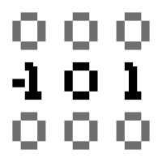

<h3 align="center">
  <picture>
    <source media="(prefers-color-scheme: dark)" srcset="./assets/icon.svg">
    
  </picture>  
  1.58bit LLM Inference
</h3>

  As my introduction to Rust and LLM inference.

